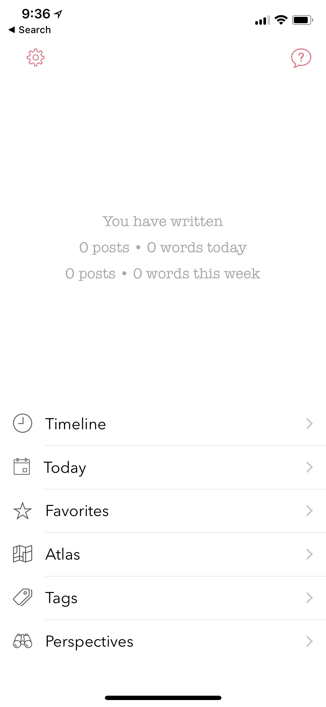

========
Getting Around in the App
========

The navigation of the app is structured slightly differently in iOS and macOS due to the differences in their user interfaces. On the other hand, the user interfaces across iPhone and iPad resemble closely since they are part of the same app and ecosystem. In this section, we will start first by describing the iOS app and then branch into macOS as we drill down into each section. 

At a high level, the app is structured into following key areas:

Main Menu
^^^^^^^^^
   
This is the parent view of the app from where you could get to all the other child views. For example, child views such as Timeline, Today, Perspectives, Settings etc. can be navigated to from this view. 

To get to this view, you can press the back arrow button < from the default view.

Timeline
^^^^^^^^^

The Timeline view is the default view that is loaded when the app is launched (we will tell you more in the Chapter 6 Personalize on how to change this default view from Settings). This view is grouped by day and provides a running list of all the posts in your journal.  If you have enabled iCloud, this view will fetch your posts from iCloud in a batch mode as you scroll down to the bottom of the list. 

.. image:: _images/timeline_view_ios.jpeg
   :width: 300px
   :alt: alternate text

Today
^^^^^^^^^
This alternative view to Timeline and is also called as the Day view. This view provides a list of posts from a given day with a 7 day header providing a way to swipe through the days. 

Post View
^^^^^^^^^
This is the default view when the app is loaded.

Post Metadata View
^^^^^^^^^
This is the default view when the app is loaded.

New Post
^^^^^^^^^
This is the default view when the app is loaded.

Perspectives
^^^^^^^^^
This is the default view when the app is loaded.

Favorites 
^^^^^^^^^
This is the default view when the app is loaded.

Atlas 
^^^^^^^^^
This is the default view when the app is loaded.

Tags 
^^^^^^^^^
This is the default view when the app is loaded.

Flashback
^^^^^^^^^
This is the default view when the app is loaded.

Settings
^^^^^^^^^
This is the default view when the app is loaded.
