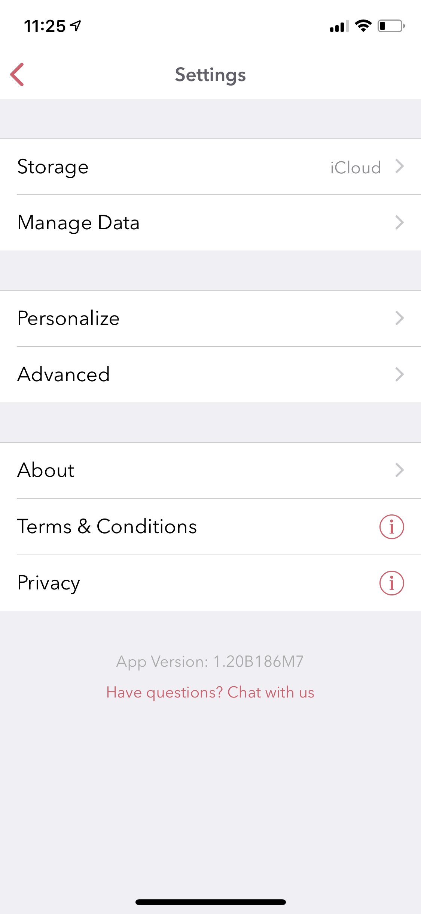

========
Navigating the App
========

The navigation of the app is structured slightly differently in iOS and macOS due to the differences in their user interfaces. On the other hand, the user interfaces across iPhone and iPad resemble closely since they are part of the same app and ecosystem. In this section, we will start first by describing the iOS app and then branch into macOS as we drill down into each section. 

At a high level, the app is structured into following key areas:

Main Menu
^^^^^^^^^
   
This is the parent view of the app from where you could get to all the other child views. For example, child views such as Timeline, Today, Perspectives, Settings etc. can be navigated to from this view. 

.. image:: _images/main_menu_ios.jpg
   :width: 300px
   :alt: alternate text

To get to this view, you can press the back arrow button < from the default view.

Timeline
^^^^^^^^^

The Timeline view is the default view that is loaded when the app is launched (we will tell you more in the Chapter 6 Personalize on how to change this default view from Settings). This view is grouped by day and provides a running list of all the posts in your journal.  If you have enabled iCloud, this view will fetch your posts from iCloud in a batch mode as you scroll down to the bottom of the list. 

.. image:: _images/timeline_view_ios.jpeg
   :width: 300px
   :alt: alternate text

Today
^^^^^^^^^
This is also called as the Day view and provides an alternative to the default Timeline view. This view provides a list of posts from a given day with a 7 day header providing a way to swipe through the days. The trails of places you visit are also displayed on this view in a map above the post listings (Note: This is turned off by default and needs to be turned on from Settings).

.. image:: _images/iphone_today_week.jpg
   :width: 300px
   :alt: alternate text

Post View
^^^^^^^^^
This view provides details of a given post. This view also provides visibility into tags and geolocation information that is used in the post. There are additional menu options here (... button) that can be used to tweak this view such as toggling large vs small image display, adding afterthoughts etc.

.. image:: _images/iphone_post_view.jpeg
   :width: 300px
   :alt: alternate text

Post Metadata View
^^^^^^^^^
This view can be reached by clicking the i button from the post detail view. This view provides visibility into the additional metadata attributes that are captured as part of the post. 

.. image:: _images/iphone_post_metadata.jpeg
   :width: 300px
   :alt: alternate text

New Post
^^^^^^^^^
This view is used to create a new entry. To get here, click the circular + button that is located at the lower right part of the screen on Timeline or Today view. The toolbar located in this view provides a way to enter rich text entries. There are also options to edit the datetime and location of the entry.

.. image:: _images/iphone_editor.jpeg
   :width: 300px
   :alt: alternate text

Atlas 
^^^^^^^^^
This view is located in the Main Menu window and displays the entries in a map view.

.. image:: _images/iphone_atlas.jpeg
   :width: 300px
   :alt: alternate text

Tags 
^^^^^^^^^
This is the default view when the app is loaded.

.. image:: _images/iphone_tags_management.jpeg
   :width: 300px
   :alt: alternate text

Perspectives
^^^^^^^^^
This is the default view when the app is loaded.

.. image:: _images/iphone_perspective.jpeg
   :width: 300px
   :alt: alternate text

Flashback
^^^^^^^^^
This is the default view when the app is loaded.

.. image:: _images/iphone_flashback.png
   :width: 300px
   :alt: alternate text

Settings
^^^^^^^^^
This is the default view when the app is loaded.

