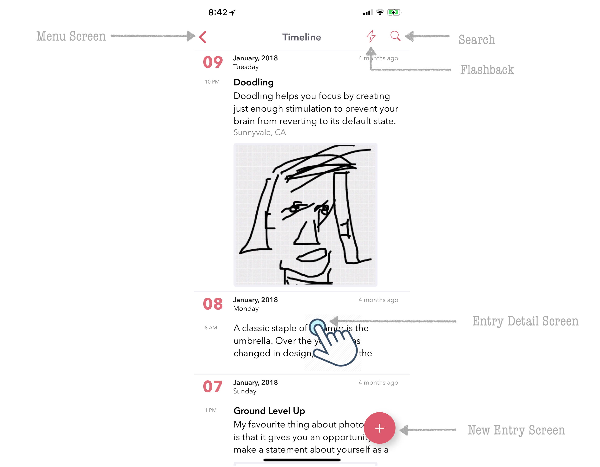
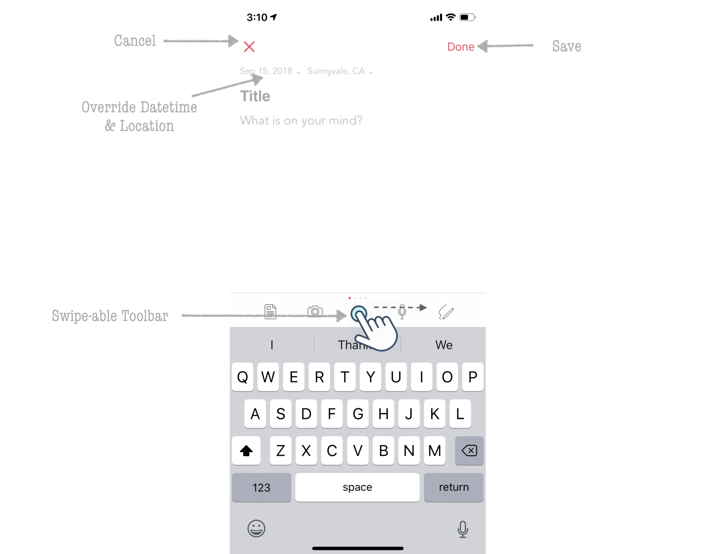
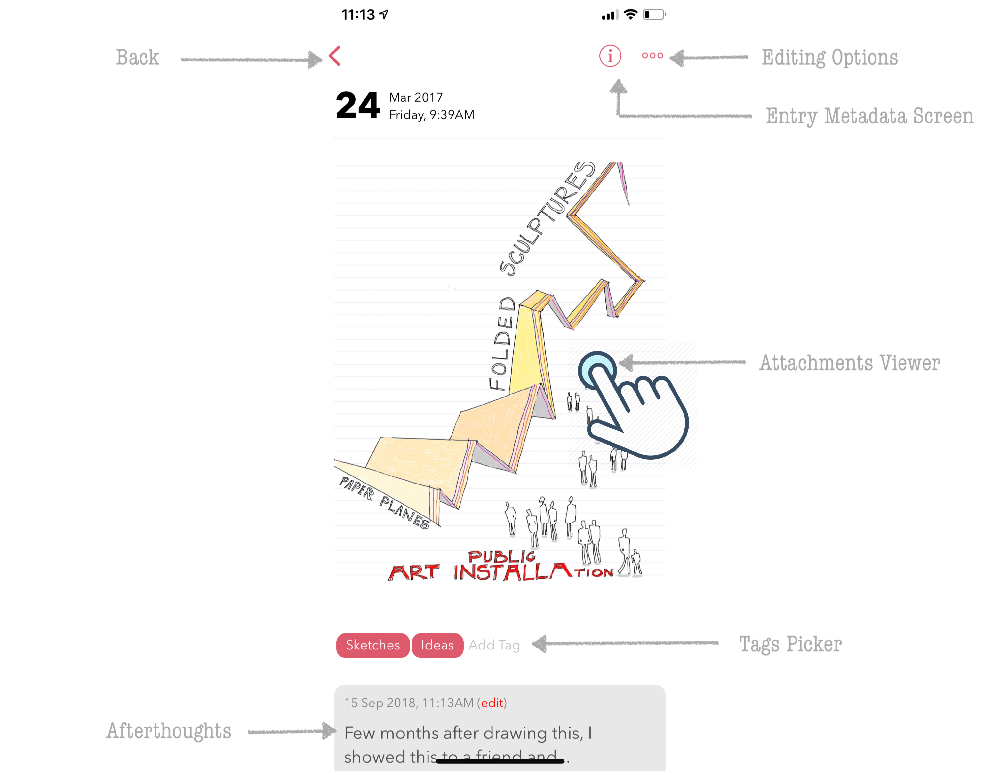
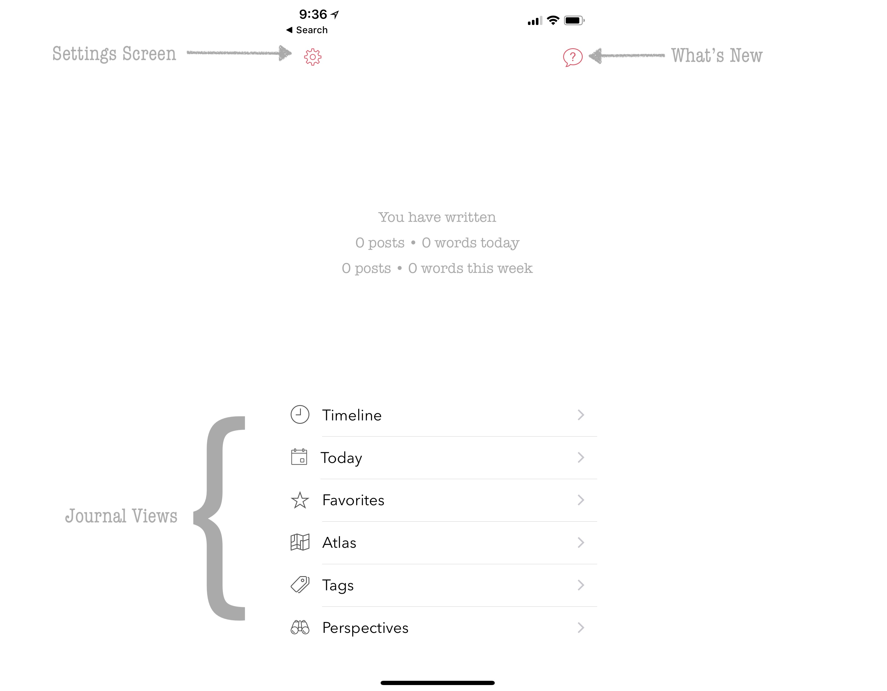
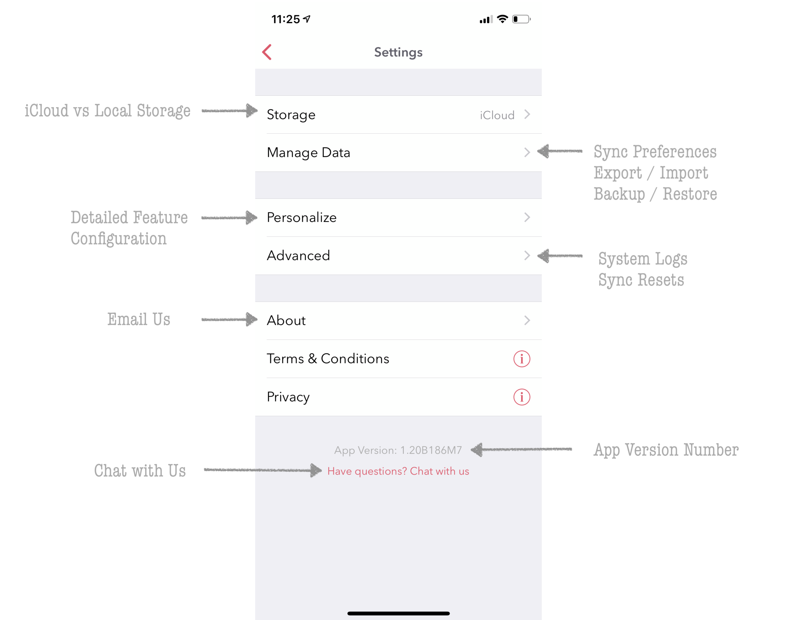

========
Navigating the App
========

The navigation of the app is structured slightly differently in iOS and macOS due to the differences in their user interfaces. In this section, we will start first by describing the iOS app and then branch into macOS as we drill down into each section. 

At a high level, the app is structured into following five key screens:

Landing Screen
^^^^^^^^^
This is the default screen that is loaded when the app is launched. From here, you can search for an entry, tap on a given entry and view its details, do bulk edits across multiple entries, view entries from the past (Flashback), and even create new entries using the New Entry + button. 

Clicking the back arrow key on the top (<) will take you to the Main Menu screen of the app where additional features can be accessed or configured via Settings.

New Entry Screen
^^^^^^^^^
Dyrii comes with a WYSIWYG (What You See Is What You Get) editor that supports inline attachments. This editor is located in this screen. The editor is designed to be clutter free and most of the editing controls and options are tucked away from view under the scrollable toolbar for distraction free writing.

While creating a new entry, the editor defaults the datetime, location values on current values but you can override these values by tapping on the date, location labels as indicated in the above screen. 

Entry Detail Screen
^^^^^^^^^
This view is located one level down from the Landing Screen and can be reached by tapping anywhere on entry row/cell. This view displays the key content from the entry in a scrollview. 

Menu Screen
^^^^^^^^^

Settings Screen
^^^^^^^^^

