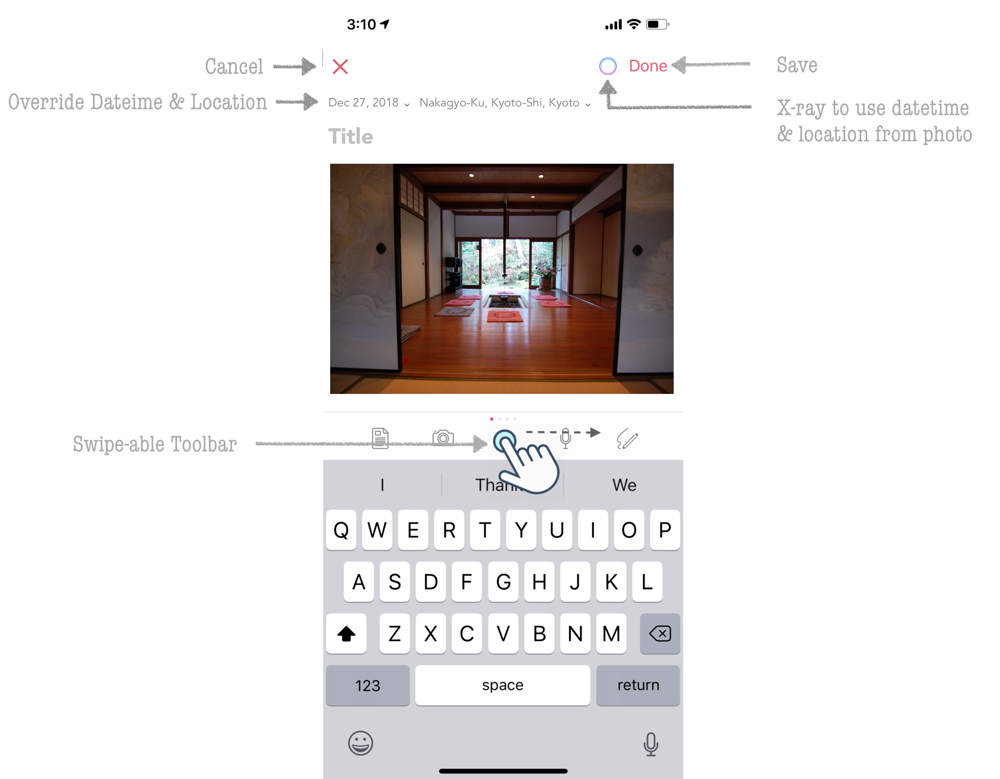

========
Navigating the App
========

The navigation of the app is structured slightly differently in iOS and macOS due to the differences in their user interfaces. In this section, we will start first by describing the iOS app and then branch into macOS as we drill down into each section. 

At a high level, the app is structured into following five key screens:

Landing Screen
^^^^^^^^^
This is the default screen that is loaded when the app is launched. From here, you can search for an entry, tap on a given entry and view its details, do bulk edits across multiple entries, view entries from the past (Flashback), and even create new entries using the New Entry + button. 

Clicking the back arrow key on the top (<) will take you to the Main Menu screen of the app where additional features can be accessed or configured via Settings.

New Entry Screen
^^^^^^^^^
Dyrii comes with a WYSIWYG (What You See Is What You Get) editor that supports inline attachments. This editor is located in this screen. The editor is designed to be clutter free and most of the editing controls and options are tucked away from view under the scrollable toolbar for distraction free writing.

While creating a new entry, the editor defaults the datetime, location values on current values but you can override these values by tapping on the date, location labels as indicated in the above screen. In addition, Dyrii also supports using datetime and location information from attached photos using the Photo X-ray button that is displayed when the metadata from photo is detected.

Entry Detail Screen
^^^^^^^^^
This view is located one level down from the Landing Screen and can be reached by tapping anywhere on entry row/cell. This view displays the key content (such as text with inline attachments, datetime, location, tags) from the entry in a scrollview. Other secondary information (metadata) is located in a seperate Metadata view which can be reached by tapping the i button on top right. Similarly, enlarged version of attachments are displayed in a seperate Attachments view which is shown when you tap on the attachment as indicated in the below image.

.. image:: _images/navigation_entrydetail_iOS.png
   :alt: iOS Timeline

All entries can be edited anytime using the editing options located under the more options (...) button. Tags can added or removed from the entry without requiring to enter the edit mode by tapping on the Tag Picker. Another innovate feature that is not found in other apps is the abitity to add additional notes to an existing entry without editing the original entry. We call this feature 'Afterthoughts' and this option exists under the more options (...) button. We will cover this feature in detail in our next chapter.

Menu Screen
^^^^^^^^^
This is one of the most important screens that you should know about. This screen contains several Journal views that can be used to look at your journal data. We have already looked at one (Timeline view) while discussing Landing Screen. But there are many more in this screen such as Day View, Atlas, Favorites, Tags, Year, Cities, etc.

.. image:: _images/navigation_menu_iOS.png
   :alt: iOS Timeline

This view also contains the doorway to Settings screen from where you can configure and personalize several features in Dyrii. 

Settings Screen
^^^^^^^^^
The Settings screen is organized into several sections for ease of access as indicated in below figure. Less frequently used features such System Logs and Sync Resets are tucked away under Advanced Features section. Whereas most frequently used options are located under Manage Data and Personalisation sections. 

.. image:: _images/navigation_settings_iOS.png
   :alt: iOS Timeline

