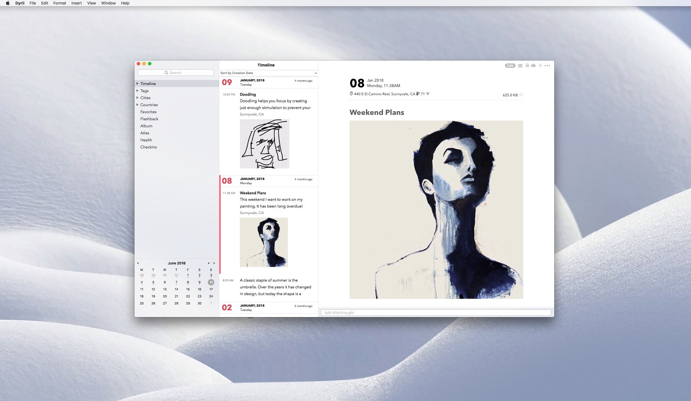
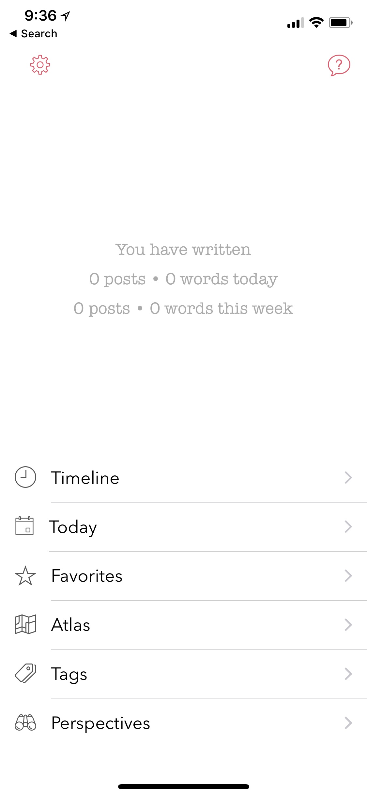
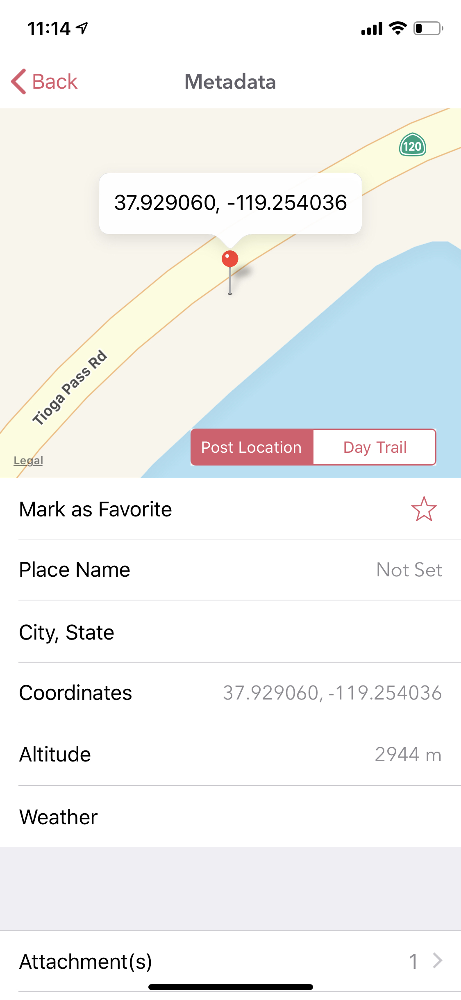
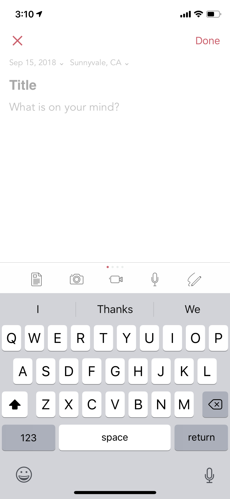
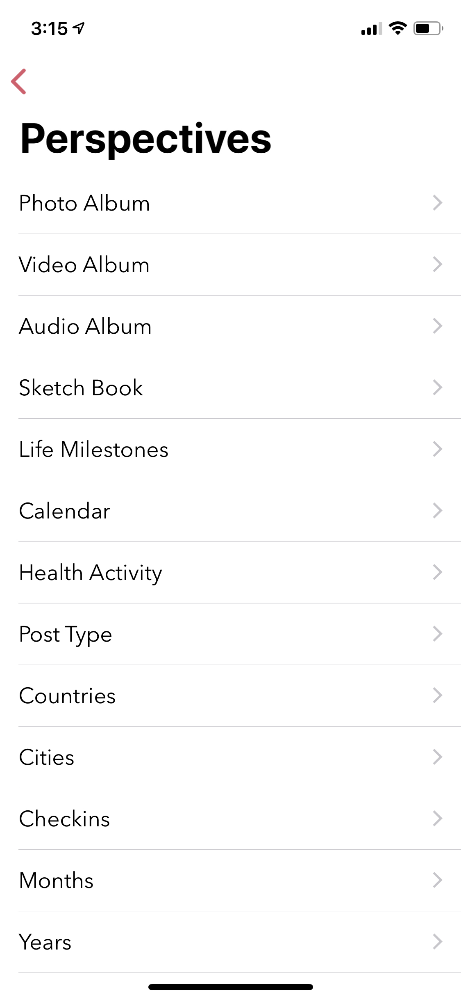

========
Navigating the App
========

The navigation of the app is structured slightly differently in iOS and macOS due to the differences in their user interfaces. On the other hand, the user interfaces across iPhone and iPad resemble closely since they are part of the same app and ecosystem. In this section, we will start first by describing the iOS app and then branch into macOS as we drill down into each section. 

At a high level, the app is structured into following key areas:

Timeline
^^^^^^^^^
Timeline is loaded as the default view when the app is launched. All your journal entries are loaded here grouped and sorted by creation date. We will tell you more in Chapter 6 Personalize on how to change this default view from Settings. 

.. image:: _images/timeline_view_ios.jpeg
   :width: 300px
   :alt: iOS Timeline
   

Note: If you have enabled iCloud, this view in iOS will fetch your posts from iCloud in a batches for 100 and consecutive batches will be downloaded as you scroll down to the bottom of this view. On macOS, this behavior is slighly different where we download all the entries on the device instead of batching it like we do on iOS.

Main Menu
^^^^^^^^^
The Main Menu is located at the root of the app. To get here, click on back arrow button (<) from the Timeline (or Today) view. From this view you can get to all the other views in the app. For example, child views such as Timeline, Today, Perspectives, Settings etc. can be navigated to from this view. 

Today
^^^^^^^^^
This is also called as the Day view and provides an alternative to the default Timeline view. This view provides a list of posts from a given day with a 7 day header providing a way to swipe through the days. The trails of places you visit are also displayed on this view in a map above the post listings (Note: This is turned off by default and needs to be turned on from Settings).

.. image:: _images/iphone_today_week.jpg
   :width: 300px
   :alt: alternate text

Post Detail
^^^^^^^^^
This view provides details of a given post. This view also provides visibility into tags and geolocation information that is used in the post. There are additional menu options here (... button) that can be used to tweak this view such as toggling large vs small image display, adding afterthoughts etc.

.. image:: _images/iphone_post_view.jpeg
   :width: 300px
   :alt: alternate text

Post Metadata 
^^^^^^^^^
This view can be reached by clicking the i button from the post detail view. This view provides visibility into the additional metadata attributes that are captured as part of the post. 

Editor
^^^^^^^^^
This view is used to create a new entry. To get here, click the circular + button that is located at the lower right part of the screen on Timeline or Today view. You can also get to this view from the Post Detail view by clicking on the Edit option. The toolbar located in this view provides a way to enter rich text entries. There are also options to edit the datetime and location of the entry.

Atlas 
^^^^^^^^^
Sometimes displaying entries in a list format is not enough, specically when you want to browse through your entires based on places you have visited across the globe. We have added Atlas view for that reason. You can get to this view from the Main Menu. 

.. image:: _images/iphone_atlas.jpeg
   :width: 300px
   :alt: alternate text

This view provides some additional customisation wherein you could toogle to view your city index on the map as pins or geolocation coordinates from each entry. 

Tags 
^^^^^^^^^
We have included Tags to give users more flexiblity in terms of organising journal entires. You can get to this view from the Main Menu. 

.. image:: _images/iphone_tags_management.jpeg
   :width: 300px
   :alt: alternate text

Perspectives
^^^^^^^^^
This is the default view when the app is loaded.

Flashback
^^^^^^^^^
Flashback is one of those features that you will appreciate once you have accumualted lot of data in your journal. This feature scans through previous year's data and resurfaces entries that you have created on this day. You can access this view from two places: Timeline view and Today view.

.. image:: _images/iphone_flashback.png
   :width: 300px
   :alt: alternate text

This view has some additional options to view entries from this day, week, or based on current geolocation. We will talk more about this in Chapter 3.

Settings
^^^^^^^^^
All the controls are located in this view. From here you can personalize the app, manage your iCloud sync settings, and import/export/backup options. To get to this view, click on the gear button that is located top left in Main Menu. We will talk more about this view in Chapter 3 and 4.

.. image:: _images/iphone_settings.png
   :width: 300px
   :alt: alternate text
