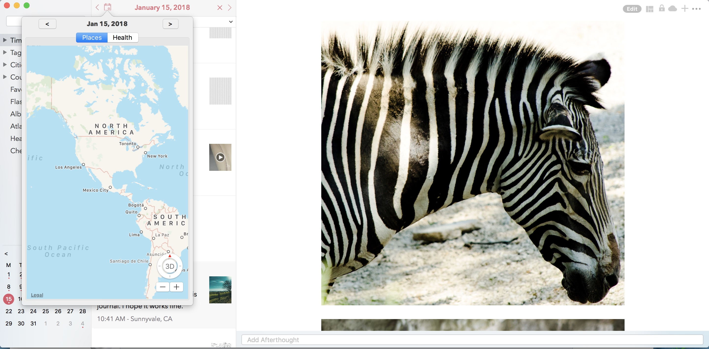

========
Key Features
========

.. index:: Timeline
Timeline
--------

This section of the app provides a rolling timeline of all your entries by creation timestamp. Entries are grouped by day under a date header.

iOS

Mac
On the Mac, the timeline view is integrated with the year and month perspective view for ease of use on a bigger screen.

.. index:: Day View
Day View
------------
While some users may like a rolling timeline view, some may prefer a more traditional day by day view format. The Today view addresses this need. The users are also allowed to set this view as their default view from under Menu.

iOS
While the default view is loaded for the current week, users can swipe left or right to scroll through their weeks. The view on the top has a top-down swipe gesture to expand the number of visible days to display a full month.

The today view also displays all the places you have visited during the given day. Feature is turned off by default due to privacy reasons but can be turned on from Settings/Personalize/Track Place Visited.

Mac
On Mac, the today view is integrated with the Calander view located at the bottom of the Sidebar. Clicking any one of the date cells will change the timeline view to display posts from the selected day. The selected day is highlighted in the calendar view with a round circular shade as well as displayed on the timeline view header. 

To deselect the day view, simply click on the X button on the top of the view. 

.. index:: Perspective
Perspective
----------
Perspective is a premium section that provides various lens for viewing your data. For example, a view into your entires by year, by month, by city, country. etc.

iOS
To access this section, navigate to Menu/Perspective. New users are allowed 25 free previews to this section to give them a feel of this feature.

Mac
Pespectives on Mac is spread into multiple menu items on the Sidebar. For example, to view entries by year, you drill down under the Timeline menu. 

Similarly, the Atlas perspective that displays all your entries on a map is accessible by clicking on the Atlas menu item in the sidebar.

The Health perspective provides a view into your health and mood entries group by month and year. There an option to even print this as a PDF report so that you can takeit with you to the doctor.

.. index:: Editor
Editor
-------
Dyrii supports entering posts in rich text format with inline images. The controls to format the text are available on the Editor Toolbar. 

iOS
On iOS, the toolbar appears right below the keyboard.

Mac
On Mac, the toolbar appears at the bottom of the screen.

.. index:: Day Trails
Day Trails
-------
Day trails allow you to track all the places you visit in a day on a day by day map view. This feature is disabled by default but can be enabled from Settings/Personalize.

   This is the caption of the figure (a simple paragraph).

Writing Templates
------------
Dyrii allows you to tag health events in your journal which then gets displayed in the Health section where it can be printed into a report. 

Life Milestones
------------

Install $project by running:
    install project

Health Events
----------
Dyrii allows you to tag health events in your journal which then gets displayed in the Health section where it can be printed into a report. 

To add health event, navigate to the Editor and click on the "Add Symptoms" link on the toolbar.

Place Checkins
-------

Place checkin is a feature that allows you to bookmark a specific location in an entry. It works very similar to how Facebook Check in works. To access this feature, select the "Checkin" option from the new post screen.

The Checkin page will automatically show you the list of places that are near your current location. If the list of places does not load automatically, then click on the location triangle button on the top to reload the list. 

You can also search for a specific location using the search bar on the top.

Checkin information is stored against the post entry. We store the following information for checkins.

Name of the Place
Place Category (for example, restaurant, coffee shop, etc.) 
Address of the Place
Coordinates of the Place
Google Places URL of the Place
The above information is also indexed and shown on the Perspective section. Right now the perspective section shows very limited information about these checkins but we plan to expand this in the future to also display checkin statistics.

Mood
-------
Dyrii allows you to record your mood history against an entry. This function resides in the editor and can be invoked by clicking on the "Add Mood" link. 

The popup list all available mood option. Currently, you will not be able to add custom entries to this list but you can email us if you would like us to add a new entry that wemight have missed.

Passcode
-------
The passcode protection when activated locks your journals to protect your privacy. While setting the passcode, please keep it in a safe place so that you can access it in case you forget it. Please note that we will be unable to reset the passcode for you. 

Note: The passcode protection is local to the device and the passcode does not sync across devices. 

iOS

To set passcode protection, navigate to Settings/Personalize/Passcode option and enable this option. 

Mac

On the mac, to enable this function, click on the lock button on the toolbar and pick a passcode. 

Importing from Photos App
-------
To set passcode protection, navigate to Settings/Personalize/Passcode option and enable this option. Both the timeline and day view contains bulk editing options that are available by long-pressing an entry. Using the bulk action, you will be able to due following action on multiple entires:

Backdating Entries
-------
Both the timeline and day view contains bulk editing options that are available by long-pressing an entry. Using the bulk action, you will be able to due following action on multiple entires:

a) Delete 

b) Export

c) Tag

Note: Bulk editing options are currently not available on Mac.

iOS

The project is licensed under the BSD license.
