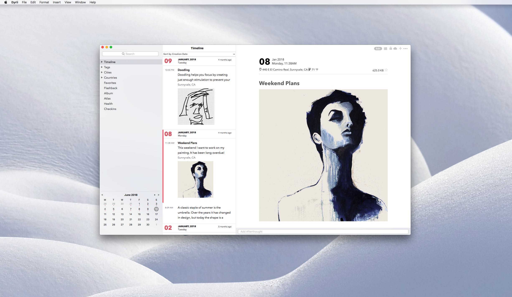
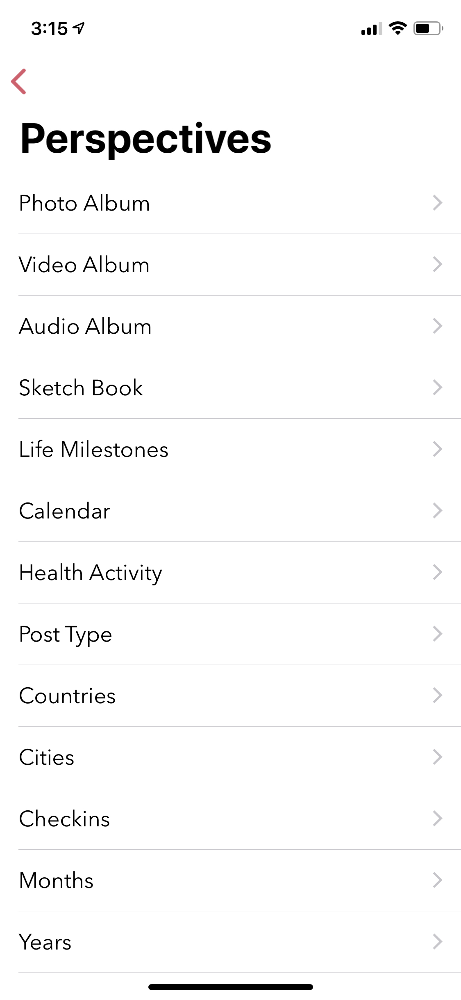
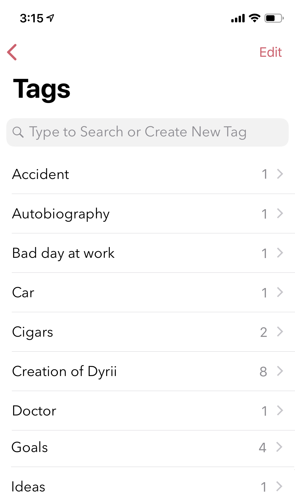

========
Key Features
========

.. index:: Timeline
Timeline
--------
This view provides a rolling timeline of all your entries in the journal. If you have enabled iCloud, this view in iOS will fetch your posts from iCloud in a batches for 100 and consecutive batches will be downloaded as you scroll down to the bottom of this view. On macOS, this behavior is slighly different where we download all the entries on the device instead of batching it like we do on iOS.

.. image:: _images/timeline_view_ios.jpeg
   :width: 300px
   :alt: iOS Timeline

In this view, all your journal entries are loaded here grouped and sorted by creation date. We will tell you more in Chapter 6 Personalize on how to change this default view from Settings. 

.. index:: Day View
Day View
------------
While some users may like a rolling timeline view, some may prefer a more traditional day by day view format. The Day view addresses this need. The users are also allowed to set this view as their default view from under Menu.

.. image:: _images/iphone_today_week.jpg
   :width: 300px
   :alt: alternate text

iOS: While the default view is loaded for the current week, users can swipe left or right to scroll through their weeks. The view on the top has a top-down swipe gesture to expand the number of visible days to display a full month.

The today view also displays all the places you have visited during the given day. Feature is turned off by default due to privacy reasons but can be turned on from Settings/Personalize/Track Place Visited.

Mac: On Mac, the today view is integrated with the Calander view located at the bottom of the Sidebar. Clicking any one of the date cells will change the timeline view to display posts from the selected day. The selected day is highlighted in the calendar view with a round circular shade as well as displayed on the timeline view header. To deselect the day view, simply click on the X button on the top of the view. 

.. index:: Perspective
Perspective
----------
Perspective view provides various lens for viewing your data. For example, a view into your entires by year, by month, by city, country. etc.

iOS: To access this section, navigate to Menu/Perspective. New users are allowed 25 free previews to this section to give them a feel of this feature.

Mac: Pespectives on Mac is spread into multiple menu items on the Sidebar. For example, to view entries by year, you drill down under the Timeline menu. 

Similarly, the Atlas perspective that displays all your entries on a map is accessible by clicking on the Atlas menu item in the sidebar.

The Health perspective provides a view into your health and mood entries group by month and year. There an option to even print this as a PDF report so that you can takeit with you to the doctor.

Atlas 
^^^^^^^^^
Sometimes displaying entries in a list format is not enough, specically when you want to browse through your entires based on places you have visited across the globe. We have added Atlas view for that reason. You can get to this view from the Main Menu. 

.. image:: _images/iphone_atlas.jpeg
   :width: 300px
   :alt: alternate text

This view provides some additional customisation wherein you could toogle to view your city index on the map as pins or geolocation coordinates from each entry. 

.. index:: Editor
Editor
-------
Dyrii supports entering posts in rich text format with inline attachments (images, audio, video files). The controls to format the text are available on the swipeable toolbar which is located above the keyboard as shown in the image below.

.. image:: _images/iphone_editor_toolbar.PNG
   :width: 300px
   :alt: alternate text

Mac: On Mac, the toolbar appears at the bottom of the screen and is collapsed by default. These options are also located under the menu bar as indicated in the image below.

.. image:: _images/Editor_macOS_Controls_Collapsed.png
   :alt: alternate text
   

.. image:: _images/Editor_macOS_Controls_Expanded.png
   :alt: alternate text
   
   
.. image:: _images/Editor_macOS_Controls_Menubar.png
   :alt: alternate text

Attaching Photos
-------
Dyrii supports entering posts in rich text format with inline images. The controls to format the text are available on the Editor Toolbar. 

Attaching Video
-------
Dyrii supports entering posts in rich text format with inline images. The controls to format the text are available on the Editor Toolbar. 

Attaching Audio
-------
Dyrii supports entering posts in rich text format with inline images. The controls to format the text are available on the Editor Toolbar. 

Checking In
-------
Dyrii supports entering posts in rich text format with inline images. The controls to format the text are available on the Editor Toolbar. 

Attaching Weather Info
-------
Dyrii supports entering posts in rich text format with inline images. The controls to format the text are available on the Editor Toolbar. 

Changing Metadata
-------
This view can be reached by clicking the i button from the post detail view. This view provides visibility into the additional metadata attributes that are captured as part of the post. 

.. image:: _images/iphone_post_metadata.jpeg
   :width: 300px
   :alt: alternate text

.. index:: Day Trails
Day Trails
-------
Day trails allow you to track all the places you visit in a day on a day by day map view. This feature is disabled by default but can be enabled from Settings/Personalize.

.. figure:: _images/day_trails.jpg
   :width: 100 %
   :alt: map to buried treasure

   This is the caption of the figure (a simple paragraph).

Writing Templates
------------
Dyrii allows you to tag health events in your journal which then gets displayed in the Health section where it can be printed into a report. 

Tags
------------
Dyrii allows you to create custom tags to better organising journal entires. There is also a journal view to view/print entries by tags.

Sketching 
------------
Sketching using Apple Pencil

Life Milestones
------------

.. image:: _images/day_trails.jpg
   :width: 200px
   :alt: alternate text
   :align: right

Install $project by running:
    install project

Flashback
----------
Flashback is one of those features that you will appreciate once you have accumualted lot of data in your journal. This feature scans through previous year's data and resurfaces entries that you have created on this day. You can access this view from two places: Timeline view and Today view.

.. image:: _images/iphone_flashback.png
   :width: 300px
   :alt: alternate text

This view has some additional options to view entries from this day, week, or based on current geolocation. We will talk more about this in Chapter 3.

Today Extension
----------
Dyrii allows you to tag health events in your journal which then gets displayed in the Health section where it can be printed into a report. 

3D Shortcuts 
----------
Dyrii allows you to tag health events in your journal which then gets displayed in the Health section where it can be printed into a report. 

Editing Photos & Filters
----------
Dyrii allows you to tag health events in your journal which then gets displayed in the Health section where it can be printed into a report. 

Editing Sketches
----------
Dyrii allows you to tag health events in your journal which then gets displayed in the Health section where it can be printed into a report. 

Writing Statistics 
----------
Dyrii allows you to tag health events in your journal which then gets displayed in the Health section where it can be printed into a report. 

Health Events
----------
Dyrii allows you to tag health events in your journal which then gets displayed in the Health section where it can be printed into a report. 

To add health event, navigate to the Editor and click on the "Add Symptoms" link on the toolbar.

Place Checkins
-------

Place checkin is a feature that allows you to bookmark a specific location in an entry. It works very similar to how Facebook Check in works. To access this feature, select the "Checkin" option from the new post screen.

The Checkin page will automatically show you the list of places that are near your current location. If the list of places does not load automatically, then click on the location triangle button on the top to reload the list. 

You can also search for a specific location using the search bar on the top.

Checkin information is stored against the post entry. We store the following information for checkins.

Name of the Place
Place Category (for example, restaurant, coffee shop, etc.) 
Address of the Place
Coordinates of the Place
Google Places URL of the Place
The above information is also indexed and shown on the Perspective section. Right now the perspective section shows very limited information about these checkins but we plan to expand this in the future to also display checkin statistics.

Mood
-------
Dyrii allows you to record your mood history against an entry. This function resides in the editor and can be invoked by clicking on the "Add Mood" link. 

The popup list all available mood option. Currently, you will not be able to add custom entries to this list but you can email us if you would like us to add a new entry that wemight have missed.

Passcode
-------
The passcode protection when activated locks your journals to protect your privacy. While setting the passcode, please keep it in a safe place so that you can access it in case you forget it. Please note that we will be unable to reset the passcode for you. 

Note: The passcode protection is local to the device and the passcode does not sync across devices. 

iOS: To set passcode protection, navigate to Settings/Personalize/Passcode option and enable this option. 

Mac: On the mac, to enable this function, click on the lock button on the toolbar and pick a passcode. 

Importing from Photos App
-------
To set passcode protection, navigate to Settings/Personalize/Passcode option and enable this option. Both the timeline and day view contains bulk editing options that are available by long-pressing an entry. Using the bulk action, you will be able to due following action on multiple entires:

Backdating Entries
-------
Both the timeline and day view contains bulk editing options that are available by long-pressing an entry. Using the bulk action, you will be able to due following action on multiple entires:

a) Delete 

b) Export

c) Tag

Note: Bulk editing options are currently not available on Mac.

iOS:

Local Mode
-------
This pirvacy focused allows users to store data on the device without uploading them to the cloud. 

iCloud Mode
-------
how syncing works with progressive download

