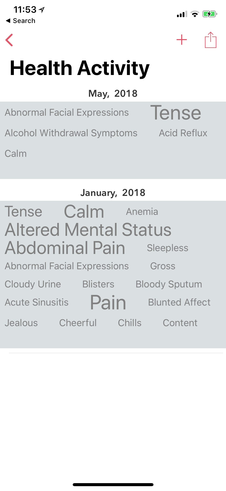
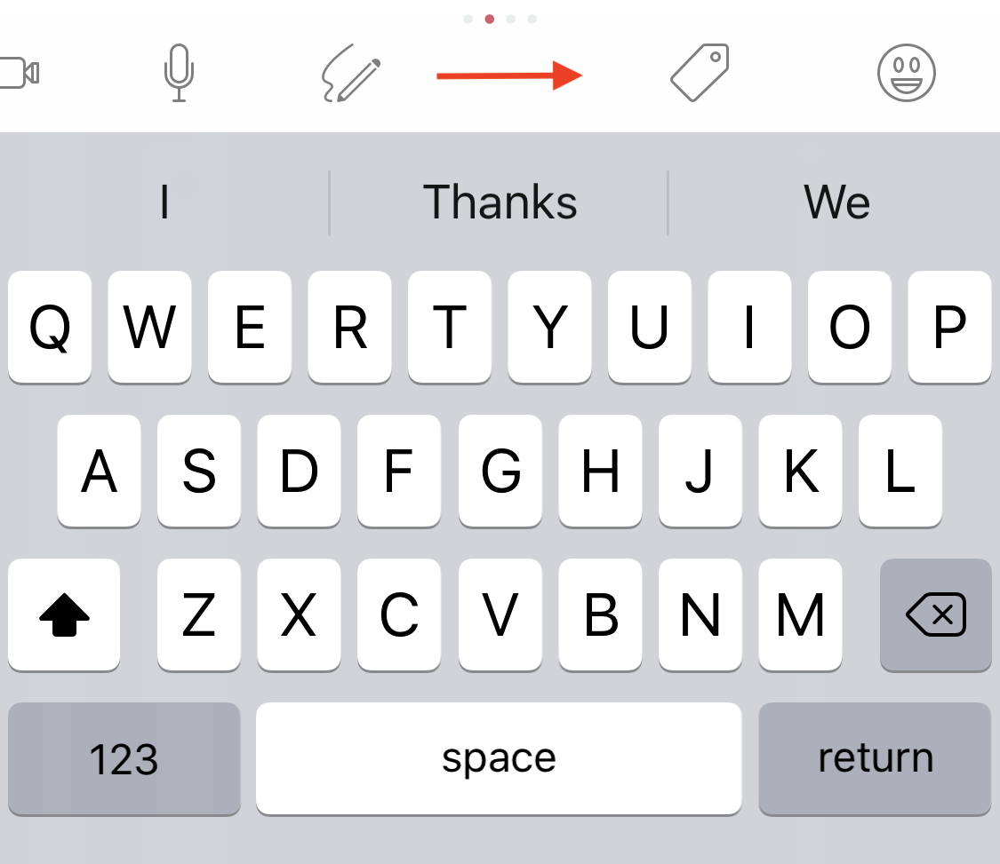

========
Key Features
========
In this section, we will cover some of the key features present in Dyrii.

.. index:: Perspective
Perspectives (Journal Views)
----------
As the name implies, this view provides different perspectives of your journal data. Timeline and Day view are two such views that we have looked at before but there are many more. In this section, we will explore these Perspective view (also called as Journal views). 

iOS: To access this section, navigate to Menu/Perspective. 

Mac: Pespectives on Mac is spread into multiple menu items on the Sidebar. For example, to view entries by year, you drill down under the Timeline menu. 

There are additional options on each perspective view that will allow you to print, export, and generate backup files.

.. index:: Timeline
Timeline
^^^^^^^^^
This view provides a rolling timeline of all your entries in the journal, grouped and sorted by creation dateime. If you have enabled iCloud, this view in iOS will fetch your posts from iCloud in a batches for 100 and consecutive batches will be downloaded as you scroll down to the bottom of this view. 

.. image:: _images/timeline_view_ios.jpeg
   :width: 300px
   :alt: iOS Timeline

On macOS, the incremental fetch behavior is slightly different where we download all the entries on the device instead of batching it like we do on iOS. This is done due to the computing resource difference across iOS and macOS. 

.. index:: Day View
Day View
^^^^^^^^^
While some users may like a rolling timeline view, some may prefer a more traditional day by day view as provided by this view. This view can also be set as the default landing screen view from Menu screen. We will talk more about this personalisation under Chapter 4. Personalisation.

   

iOS: While loading this view, we default it to today's date. But users can swipe left or right to scroll through their days. The view on the top has a top-down swipe gesture that will allow you to expand the number of visible days from week view to month view.

This view also displays all the places you have visited during the given day as pins on map. We call this view Day Trail and this feature is turned off by default due to privacy reasons. Users can turned on this feature from Settings/Personalize/Track Place Visited.

Mac: On Mac, the today view is integrated with the Calander view located at the bottom of the Sidebar. Clicking any one of the date cells will change the timeline view to display posts from the selected day. The selected day is highlighted in the calendar view with a round circular shade as well as displayed on the timeline view header. To deselect the day view, simply click on the X button on the top of the view. 

.. index:: Atlas
.. index:: Mapview
Atlas (Mapview)
^^^^^^^^^
Sometimes displaying entries in a list format is not enough, specially when you want to browse through your entires based on places you have visited across the globe. We have added Atlas view for that reason. You can get to this view from the Main Menu. Please note that to take advantage of this view, you need to enable geolocation in your entires since this information is needed to draw the Atlas view. 

This view also provides some additional customisation wherein you could toogle to view your city index on the map as pins or geolocation coordinates from each entry. 

.. index:: Cities
City View 
^^^^^^^^^
This view is similar to Atlas view expect, it is not rendered on a map. Instead the list of indexed cities are listed in alphabetical order. Tapping a city would then display all the entires tagged with that city.

.. index:: Countries View 
Countries View 
^^^^^^^^^
This view is similar to the cities view described above. If you travel to several different countries, then it is a lot easier to find a given entry using this view than looking for it through atlas or other views. 

.. index:: Attachments View
.. index:: Media View
Attachments View (Media View)
^^^^^^^^^
This view provides an alternative way of displaying entries instead of displaying it as a list of entires. This view directly displays the attachments from all the entries in an album type of view. Based on the attachment type, this view is further classified into following four views. These views are located under Menu > Perspective.  

a) Photo Album: This view displays all the photos in a canvas photo roll. Tapping an attachment on this view will open the entry that contains the tapped attachment. And if the given entry is not yet downloaded from iCloud, then this view will initiate a fetch from the cloud. 

b) Video Album: This view is similar to the photo album view with the only difference being of the attachment type. That is only video attachments are displayed here. 

c) Audio Album: This view is similar to photo and video album view with the only difference being of the attachment type. That is only audio attachments are displayed here. To help easily distinguish between various audio files, we have included an interactive sound graph in this view containing play, fast forward, controls as shown in figure below. 

d) Sketch Book: Like the name implies, this view is designed to provide a sketch book type feel by stitching together all handwritten pages to form a cohesive notebook. 

.. index:: Years
Year View 
^^^^^^^^^
This view segregates all the entries in your journal by calendar year similar to how it works in physical year based journals. This view is useful when looking back on historical years, specially when you have built up years worth of journaling data. This view also provides ability to export all the entries from a given year into a pdf for archiving or printing physical journals. 

.. index:: Calendar View  
Calendar View  
^^^^^^^^^
This view displays a running calendar with color coded dates indicating days with journal activity. This view is specially useful to look back on how consistency you have been writing journal on a day to day basis. 

.. index:: Health Activity
Health Activity
^^^^^^^^^
The Health perspective provides a view into your health and mood activity overtime. This view is rendered as a word cloud grouped by month with the most frequently used entries in bolder and larger font size as indicated in the screenshot below. This view also has an option to print the health activity as a PDF report so that you can print and carry it with you for doctor visits. We will talk about how to add these type of entries via editor in the next section. 

.. index:: Life Milestones
Life Milestones
^^^^^^^^^
This view provides a summary of major life events on a brief timeline to look back on. Major life events are flags that are tagged while creating an entry. We will talk about how to add these type of entries via editor in the next section. 

.. index:: Editor
Editor
-------
Dyrii supports entering posts in rich text format with inline attachments (images, audio, video files). The controls to format the text are available on the swipeable toolbar which is located above the keyboard as shown in the image below. 

The controls in this swipeable toolbar are organized into four pages (indicated by small dots). The first page (default page) contains controls to insert attachments such as template, photos, audio, video, and handwriting. 

The second page contains controls associated with tagging such as custom tags, health symptoms, mood, and life milestone. 

The third page contains controls for overriding datetime, location, and weather information. 

And the fourth page contains controls for formatting text such as bold, italics, bullet numbering etc. Please also note that the fourth page contains lot more text formatting options under a pop up menu than what is shown in the page as indicated in the screenshot below. 

Mac: On Mac, the toolbar appears at the bottom of the screen and is collapsed by default. These options are also located under the menu bar as indicated in the image below.

   

.. image:: _images/Editor_macOS_Controls_Expanded.png
   :alt: alternate text
   
   

Dyrii supports multiple inline attachments similar to how some of the common word processors such as Pages, Apple Notes, Microsoft Word, and Google Docs handles rich text. While this is very intuitive, we will use the next few sub-sections to talk about some of the common use cases encountered within the Editor. 

.. index:: Attaching Photos
Attaching Photos
^^^^^^^^^
This is the most commonly used function within a journal. Dyrii supports attaching multiple photos to an entry. Photos are commonly attached using the Photo picker for. where you can pick multiple photos from your Photo Library. When selecting multiple photos in a given picker instance, Dyrii creates a canvas with all the selected pictures to make them fit in one row as indicated in below screenshot. If you want to spread the photos into multiple rows, you can choose to do that by spreading the photos into multiple picker flows instead of selecting all the photos in one flow. This way, you have full control over how many photos you want the app to display in one row. 

You can also edit an already attached photo by tapping on the image, which will display a contextual menu as shown in screenshot below. 

.. index:: Attaching Vidoe
Attaching Video
^^^^^^^^^
Dyrii also supports attaching multiple video files in one entry. This function works quite similar to the photo attachment function described above.

.. index:: Attaching Audio
Attaching Audio
^^^^^^^^^
Dyrii also supports attaching multiple audio files in one entry. This function works quite similar to the photo and video attachment function described above. 

.. index:: Sketches
.. index:: Handwriting 
.. index:: Apple Pencil
Attaching Sketches
^^^^^^^^^
As described before, Dyrii support handwriting via Apple Pencil. You can also use this function to add doodles on iPhone or on other iPad that does support Apple Pencil. 

On the iPad, there are two way of entering handwriting notes:

1) You can directly start entering handwritten notes using the dedicated scribble button that is shown on the iPad UI. With this option you can enter multiple pages at once. Note, this button is not present on iPhone UI and is present only on iPad. 

2)You can add the handwriting through the editor. Using this method you will be able to add only one page at a time.

.. index:: Weather Information
Attaching Weather Info
^^^^^^^^^
Dyrii automatically add weather information while creating of entry. For fetching weather information, geolocation is necessary and therefore weather information will not be attached if you disable geolocation tagging on the entry. 

.. index:: Mood
Adding Mood
^^^^^^^^^
Dyrii allows you to record your mood history against an entry. This function resides in the editor and can be invoked by clicking on the "Add Mood" link. 

The popup list all available mood option. Currently, you will not be able to add custom entries to this list but you can email us if you would like us to add a new entry that wemight have missed.

.. index:: Health
.. index:: Symptoms
Adding Health Symptom
^^^^^^^^^
Dyrii allows you to tag health events in your journal which then gets displayed in the Health section where it can be printed into a report. 

To add health event, navigate to the Editor and click on the "Add Symptoms" link on the toolbar.

.. index:: Checkins
.. index:: Places
Adding Place Checking In
^^^^^^^^^
Place checkin is a feature that allows you to bookmark a specific location in an entry. It works very similar to how Facebook Check in works. To access this feature, select the "Checkin" option from the new post screen.

The Checkin page will automatically show you the list of places that are near your current location. If the list of places does not load automatically, then click on the location triangle button on the top to reload the list. 

You can also search for a specific location using the search bar on the top.

Checkin information is stored against the post entry. We store the following information for checkins.

Name of the Place
Place Category (for example, restaurant, coffee shop, etc.) 
Address of the Place
Coordinates of the Place
Google Places URL of the Place
The above information is also indexed and shown on the Perspective section. Right now the perspective section shows very limited information about these checkins but we plan to expand this in the future to also display checkin statistics.

.. index:: Importing from Photos App
Importing from Photos App
-------
To set passcode protection, navigate to Settings/Personalize/Passcode option and enable this option. Both the timeline and day view contains bulk editing options that are available by long-pressing an entry. Using the bulk action, you will be able to due following action on multiple entires:

.. index:: Day Trails
.. index:: Places Visited
Day Trails
-------
Day trails allow you to track all the places you visit in a day on a day by day map view. This feature is disabled by default but can be enabled from Settings/Personalize.

.. figure:: _images/day_trails.jpg
   :width: 100 %
   :alt: map to buried treasure

   This is the caption of the figure (a simple paragraph).

.. index:: Templates
Writing Templates
------------
Writing templates help you to record your day effortlessly. We have included in the template library several handpicked templates such as Dream Journal, Gratitude journal, Nightly Q&A etc.

iOS: In order to access the templates, click on the Template Library icon in the Editor Toolbar (highlighted in the screenshot below).

There are several templates available in the template library covering various journaling use cases. Each template can be previewed by clicking on the disclosure icon (circular button with i). To use one of the templates, just tap on the template row or "Use" button from the Preview page.

Note: The library will be routinely updated with new templates so if you finding something missing, please let us know and we will get them added in a future version.

While picking a template, you will be asked to confirm your action because this will replace the content in your editor and if you have any unsaved text, you might lose it. 

Mac: In order to access the templates on Mac, navigate to the Editor and click on more button. Under the more option, click on Templates to see the list of templates that are available. 

.. figure:: _images/macos_template_editor.png
   :alt: Writing Templates

In the template library screen, you will be able to preview the templates. Once you have pick the template you want to use, click on the "Use this template" button to start writing using that template.

.. index:: Tags
Tags
------------
Dyrii allows you to create custom tags to better organising journal entires. You can enter tags through the Editor while creating the entry or after the fact via the Entry Detail Screen. There is also a Tags management screen under Menu > Tags using which you will be able to mange Tags in bulk. 

The Tags management screen described above also contains views using which you can view all the entries under a given tag. This view can then be used to export and print such matching entries. 

.. index:: Favorites
Favorites
------------
Dyrii supports flagging entries as favorites. 

.. index:: Sketching
.. index:: Handwriting 
.. index:: Apple Pencil
Sketching 
------------
In addition to typing, Dyrii also supports handwriting using Apple Pencil on iPad. You can pick from various background such as lines page, graph paper, etc. It also allows you to change the font size as well as 

.. index:: Backdating 
Backdating Entries
-------
Dyrii allows you to override the datetime and location metadata on the entry so that you can create backdated entries. This option exists on the editor above the title field as shown in figure below. 

.. image:: _images/iphone_storage_option_startup.jpeg
   :width: 300px
   :alt: alternate text

.. index:: Photo X-Ray
Photo X-Ray
-------
In addition to above backdating feature, Dyrii also supports using datetime and location information from attached photos. When you attached a photo containing datetime and geolocation information, Dyrii will show a button to the left of Done button for picking metadata from attached photos. 

.. image:: _images/iphone_storage_option_startup.jpeg
   :width: 300px
   :alt: alternate text

.. index:: Editing Entries
Existing Entires
----------
Editing existing entries is a common use case. In this section, we will talk about how you can go about editing various data attributes in an existing entry. 

.. index:: Full Edit Mode
Full Edit Mode
^^^^^^^^^
To edit an entry, click on the more option button on the Entry Detail screen and then tap on Edit button. This will open the entry in Editor mode, using which you should be able to edit all the data attributes in your entry. In the Editor Mode, you can edit an already attached photo or sketch by simply tapping on it. 

Please note that while editing an entry, its existing datetime and location value is retained and not updated by default. Instead, Dyrii updates another datetime field called “Last Modified Date” to track such post dated edits. But if you would like to update the datetime and location information, you can readily do so using the override option that we discussed in few sections above. 

.. index:: Photo Edit Mode
Photo Edit Mode
^^^^^^^^^
If you use case is to only edit a specific photo (for example apply filter to the attached photo), then there is a more simpler way to edit a photo simply tapping on the photo from the Entry Detail Screen without opening the Editor. 

.. index:: Editing Handwriting
.. index:: Sketch Edit Mode
Sketch Edit Mode
^^^^^^^^^
Similar to editing photo, you can directly tap on a handwritten page to edit it instead of opening up the editor. Please note that using this option, you will not be able to insert a new page but edit an existing handwritten page. If you need to insert new page, then please use the Full Edit Mode. 

.. image:: _images/iphone_post_metadata.jpeg
   :width: 300px
   :alt: alternate text

.. index:: Flashback
Flashback
----------
Flashback is one of those features that you will appreciate once you have accumualted lot of data in your journal. This feature scans through previous year's data and resurfaces entries that you have created on this day. You can access this view from two places: Timeline view and Today view.

.. image:: _images/iphone_flashback.png
   :width: 300px
   :alt: alternate text

This view has some additional options to view entries from this day, week, or based on current geolocation. We will talk more about this in Chapter 3.

.. index:: Passcode
Passcode
-------
The passcode protection when activated locks your journals to protect your privacy. While setting the passcode, please keep it in a safe place so that you can access it in case you forget it. Please note that we will be unable to reset the passcode for you. 

Note: The passcode protection is local to the device and the passcode does not sync across devices. 

iOS: To set passcode protection, navigate to Settings/Personalize/Passcode option and enable this option. 

Mac: On the mac, to enable this function, click on the lock button on the toolbar and pick a passcode. 

.. index:: Data Storage
.. index:: Local Storage Mode 
Local Mode
-------
For users who want utmost privacy, Dyrii supports storing data locally on the device without uploading the data on any external servers. This option is prompted when you install Dyrii on startup. This preference can be changed anytime later under Settings > Storage.

.. image:: _images/iphone_storage_option_startup.jpeg
   :width: 300px
   :alt: alternate text

.. index:: iCloud Storage Mode 
iCloud Mode
-------
While Local Mode provides 100% data privacy, it doesn't provide syncing options for users who have a need to work on their journal through on multiple devices. With iCloud Mode, your data is stored on your personal iCloud account on Apple Server. This shield us from having any access to your data and provide a privacy focused product. We have also written custom sync solution on top of Apple's CloudKit framework, thereby pricing a highly reliable and efficient syncing solution. For more information, please visit below Apple documentation on iCloud.

https://developer.apple.com/icloud/
https://developer.apple.com/documentation/cloudkit

iOS: To enable iCloud, navigate to Settings > Storage and select iCloud as the option. Sync cannot be enabled unless you select iCloud for data storage. Once selected, sync will automatically turn on. We have also provided setting to disable sync when not on Wifi which can be accessed from Settings > Manage Data > Sync. 

Mac: To enable iCloud on Mac, click on the Cloud icon that is provided on the top right toolbar. This option is also located under Preference > Manage Data as indicated in below screenshot.

.. index:: Today Extension
Today Extension
----------
Dyrii allows you to tag health events in your journal which then gets displayed in the Health section where it can be printed into a report. 

.. index:: Force Touch Shortcuts
Force Touch Shortcuts 
----------
Dyrii allows you to tag health events in your journal which then gets displayed in the Health section where it can be printed into a report. 
