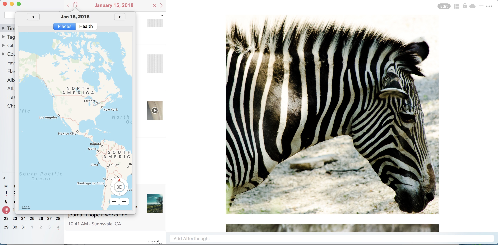
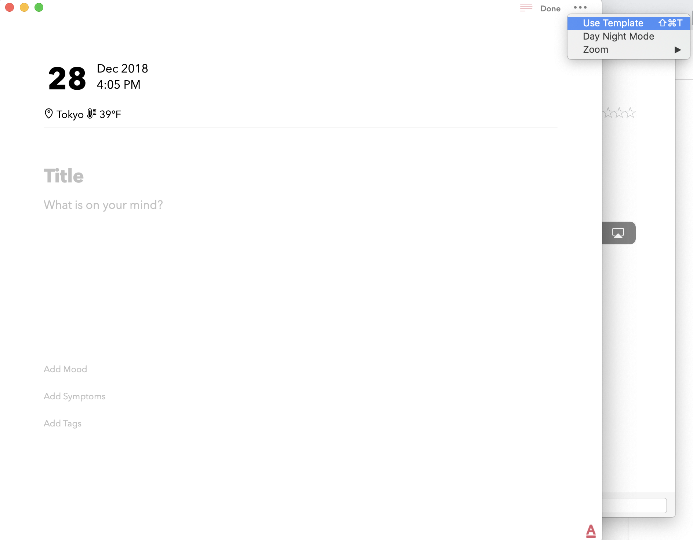

========
Key Features
========

.. index:: Timeline
Timeline
--------
This view provides a rolling timeline of all your entries in the journal, grouped and sorted by creation dateime. If you have enabled iCloud, this view in iOS will fetch your posts from iCloud in a batches for 100 and consecutive batches will be downloaded as you scroll down to the bottom of this view. 

On macOS, the incremental fetch behavior is slightly different where we download all the entries on the device instead of batching it like we do on iOS. This is done due to the computing resource difference across iOS and macOS. 

.. image:: _images/timeline_view_macOS.jpeg
   :alt: iOS Timeline

.. index:: Day View
Day View
------------
While some users may like a rolling timeline view, some may prefer a more traditional day by day view as provided by this view. This view can also be set as the default landing screen view from Menu screen. We will talk more about this personalisation under Chapter 4. Personalisation.

.. image:: _images/iphone_today_week.jpg
   :width: 300px
   :alt: alternate text

iOS: While loading this view, we default it to today's date. But users can swipe left or right to scroll through their days. The view on the top has a top-down swipe gesture that will allow you to expand the number of visible days from week view to month view.

.. image:: _images/iphone_today_month.jpg
   :width: 300px
   :alt: alternate text

This view also displays all the places you have visited during the given day as pins on map. We call this view Day Trail and this feature is turned off by default due to privacy reasons. Users can turned on this feature from Settings/Personalize/Track Place Visited.

Mac: On Mac, the today view is integrated with the Calander view located at the bottom of the Sidebar. Clicking any one of the date cells will change the timeline view to display posts from the selected day. The selected day is highlighted in the calendar view with a round circular shade as well as displayed on the timeline view header. To deselect the day view, simply click on the X button on the top of the view. 

.. index:: Perspective
Perspective
----------
As the name implies, this view provides different perspectives of your journal data. Timeline view, Day view, Atlas view are three such views that we have looked at before but there are many more e.g. Year view, Album View, Calander view, Cities view etc. some of which we will explore below.

iOS: To access this section, navigate to Menu/Perspective. 

.. image:: _images/iphone_perspective.jpeg
   :width: 300px
   :alt: alternate text

Mac: Pespectives on Mac is spread into multiple menu items on the Sidebar. For example, to view entries by year, you drill down under the Timeline menu. 

There are additional options on each perspective view that will allow you to print, export, and generate backup files.

.. index:: Health Activity
Health Activity
^^^^^^^^^
The Health perspective provides a view into your health and mood entries group by month and year. There an option to even print this as a PDF report so that you can takeit with you to the doctor.

.. index:: Atlas
Atlas 
^^^^^^^^^
Sometimes displaying entries in a list format is not enough, specically when you want to browse through your entires based on places you have visited across the globe. We have added Atlas view for that reason. You can get to this view from the Main Menu. 

.. image:: _images/iphone_atlas.jpeg
   :width: 300px
   :alt: alternate text

This view provides some additional customisation wherein you could toogle to view your city index on the map as pins or geolocation coordinates from each entry. 

.. index:: Editor
Editor
-------
Dyrii supports entering posts in rich text format with inline attachments (images, audio, video files). The controls to format the text are available on the swipeable toolbar which is located above the keyboard as shown in the image below.

.. image:: _images/iphone_editor_toolbar.PNG
   :width: 300px
   :alt: alternate text

Mac: On Mac, the toolbar appears at the bottom of the screen and is collapsed by default. These options are also located under the menu bar as indicated in the image below.

.. image:: _images/Editor_macOS_Controls_Collapsed.png
   :alt: alternate text
   

.. image:: _images/Editor_macOS_Controls_Expanded.png
   :alt: alternate text
   
   
.. image:: _images/Editor_macOS_Controls_Menubar.png
   :alt: alternate text

Attaching Photos
-------
Dyrii supports entering posts in rich text format with inline images. The controls to format the text are available on the Editor Toolbar. 

Attaching Video
-------
Dyrii supports entering posts in rich text format with inline images. The controls to format the text are available on the Editor Toolbar. 

Attaching Audio
-------
Dyrii supports entering posts in rich text format with inline images. The controls to format the text are available on the Editor Toolbar. 

Importing from Photos App
-------
To set passcode protection, navigate to Settings/Personalize/Passcode option and enable this option. Both the timeline and day view contains bulk editing options that are available by long-pressing an entry. Using the bulk action, you will be able to due following action on multiple entires:

Editing Photos & Filters
----------
Dyrii allows you to tag health events in your journal which then gets displayed in the Health section where it can be printed into a report. 

Checking In
-------
Dyrii supports entering posts in rich text format with inline images. The controls to format the text are available on the Editor Toolbar. 

Attaching Weather Info
-------
Dyrii supports entering posts in rich text format with inline images. The controls to format the text are available on the Editor Toolbar. 

Mood
-------
Dyrii allows you to record your mood history against an entry. This function resides in the editor and can be invoked by clicking on the "Add Mood" link. 

The popup list all available mood option. Currently, you will not be able to add custom entries to this list but you can email us if you would like us to add a new entry that wemight have missed.

Health Events
----------
Dyrii allows you to tag health events in your journal which then gets displayed in the Health section where it can be printed into a report. 

To add health event, navigate to the Editor and click on the "Add Symptoms" link on the toolbar.

Place Checkins
-------

Place checkin is a feature that allows you to bookmark a specific location in an entry. It works very similar to how Facebook Check in works. To access this feature, select the "Checkin" option from the new post screen.

The Checkin page will automatically show you the list of places that are near your current location. If the list of places does not load automatically, then click on the location triangle button on the top to reload the list. 

You can also search for a specific location using the search bar on the top.

Checkin information is stored against the post entry. We store the following information for checkins.

Name of the Place
Place Category (for example, restaurant, coffee shop, etc.) 
Address of the Place
Coordinates of the Place
Google Places URL of the Place
The above information is also indexed and shown on the Perspective section. Right now the perspective section shows very limited information about these checkins but we plan to expand this in the future to also display checkin statistics.

Changing Metadata
-------
This view can be reached by clicking the i button from the post detail view. This view provides visibility into the additional metadata attributes that are captured as part of the post. 

.. image:: _images/iphone_post_metadata.jpeg
   :width: 300px
   :alt: alternate text

.. index:: Day Trails
Day Trails
-------
Day trails allow you to track all the places you visit in a day on a day by day map view. This feature is disabled by default but can be enabled from Settings/Personalize.

   This is the caption of the figure (a simple paragraph).

Writing Templates
------------
Writing templates help you to record your day effortlessly. We have included in the template library several handpicked templates such as Dream Journal, Gratitude journal, Nightly Q&A etc.

.. figure:: _images/ios_template_list.jpeg
   :width: 300px
   :alt: Writing Templates

iOS: In order to access the templates, click on the Template Library icon in the Editor Toolbar (highlighted in the screenshot below).

.. figure:: _images/ios_template_editor.png
   :width: 300px
   :alt: Writing Templates

There are several templates available in the template library covering various journaling use cases. Each template can be previewed by clicking on the disclosure icon (circular button with i). To use one of the templates, just tap on the template row or "Use" button from the Preview page.

Note: The library will be routinely updated with new templates so if you finding something missing, please let us know and we will get them added in a future version.

.. figure:: _images/ios_template_editor.png
   :width: 300px
   :alt: Writing Templates

While picking a template, you will be asked to confirm your action because this will replace the content in your editor and if you have any unsaved text, you might lose it. 

Mac: In order to access the templates on Mac, navigate to the Editor and click on more button. Under the more option, click on Templates to see the list of templates that are available. 

In the template library screen, you will be able to preview the templates. Once you have pick the template you want to use, click on the "Use this template" button to start writing using that template.

.. figure:: _images/macos_template_list.png
   :alt: Writing Templates

Tags
------------
Dyrii allows you to create custom tags to better organising journal entires. There is also a journal view to view/print entries by tags.

Sketching 
------------
Sketching using Apple Pencil

Life Milestones
------------

Install $project by running:
    install project

Flashback
----------
Flashback is one of those features that you will appreciate once you have accumualted lot of data in your journal. This feature scans through previous year's data and resurfaces entries that you have created on this day. You can access this view from two places: Timeline view and Today view.

This view has some additional options to view entries from this day, week, or based on current geolocation. We will talk more about this in Chapter 3.

Today Extension
----------
Dyrii allows you to tag health events in your journal which then gets displayed in the Health section where it can be printed into a report. 

3D Shortcuts 
----------
Dyrii allows you to tag health events in your journal which then gets displayed in the Health section where it can be printed into a report. 

Editing Sketches
----------
Dyrii allows you to tag health events in your journal which then gets displayed in the Health section where it can be printed into a report. 

Writing Statistics 
----------
Dyrii allows you to tag health events in your journal which then gets displayed in the Health section where it can be printed into a report. 

Passcode
-------
The passcode protection when activated locks your journals to protect your privacy. While setting the passcode, please keep it in a safe place so that you can access it in case you forget it. Please note that we will be unable to reset the passcode for you. 

Note: The passcode protection is local to the device and the passcode does not sync across devices. 

iOS: To set passcode protection, navigate to Settings/Personalize/Passcode option and enable this option. 

Mac: On the mac, to enable this function, click on the lock button on the toolbar and pick a passcode. 

Backdating Entries
-------
Both the timeline and day view contains bulk editing options that are available by long-pressing an entry. Using the bulk action, you will be able to due following action on multiple entires:

a) Delete 

b) Export

c) Tag

Note: Bulk editing options are currently not available on Mac.

iOS:

Local Mode
-------
For users who want utmost privacy, Dyrii supports storing data locally on the device without uploading the data on any external servers. This option is prompted when you install Dyrii on startup. This preference can be changed anytime later under Settings > Storage.

iCloud Mode
-------
While Local Mode provides 100% data privacy, it doesn't provide syncing options for users who have a need to work on their journal through on multiple devices. With iCloud Mode, your data is stored on your personal iCloud account on Apple Server. This shield us from having any access to your data and provide a privacy focused product. We have also written custom sync solution on top of Apple's CloudKit framework, thereby pricing a highly reliable and efficient syncing solution. For more information, please visit below Apple documentation on iCloud.

https://developer.apple.com/icloud/
https://developer.apple.com/documentation/cloudkit

iOS: To enable iCloud, navigate to Settings > Storage and select iCloud as the option. Sync cannot be enabled unless you select iCloud for data storage. Once selected, sync will automatically turn on. We have also provided setting to disable sync when not on Wifi which can be accessed from Settings > Manage Data > Sync. 

Mac: To enable iCloud on Mac, click on the Cloud icon that is provided on the top right toolbar. This option is also located under Preference > Manage Data as indicated in below screenshot.

.. image:: _images/mac_preference_manage_data.png
   :alt: alternate text

.. image:: _images/mac_main_view.png
   :alt: alternate text

