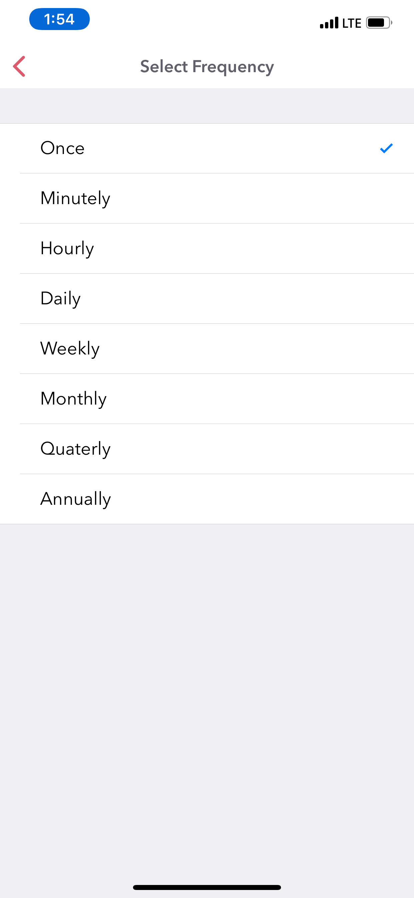

========
Personalization
========

Dyrii allows users to configure some of the features to make it more personal and specific to their needs. Both iOS and Mac apps have a Personalization section within the Settings Screen for this purpose. In this chapter, we will discuss some of the key personalization option in more detail. 

Please note that these personalization options are stored locally in the given device and is not  synced across other devices or reapplied when app is deleted and reinstalled. 

Default Landing Screen
--------
While Dyrii comes with Timeline view set as the default Landing Screen view, this can be changed to Day View from Settings > Personalize > Default View.

Day Trails
------------
This feature tracks all the places you visit in a given day and draws it on a map view with pins indicating the places where you stopped over. This feature is turned off my default due to privacy reasons and need to be consciously turned on by the user from Settings > Personalization > Track Places Visited. This feature works by setting a geofence based on your current location and updating the geofence it when you move outside. Since the accuracy of the pins are based on the radius of the geofence, we have exposed the radius as an option that users can configure. 

Please note that selecting a smaller radius will consumer more battery power so pick a value based on your need and context. 

Passcode
----------
Dyrii comes with a passcode feature that can be used to block other members who may have access to your device from viewing your journal entries. Dyrii supports both strong alphanumeric password based locks as well as Apple’s Touch ID and Face ID based locks. While setting the passcode, please keep it in a safe place so that you can access it in case you forget it since we are be unable to reset the passcode for you. 

Note: The passcode protection is local to the device and the passcode does not sync across devices. 

iOS
To set passcode protection, navigate to Settings/Personalize/Passcode option and enable this option. 

Mac
On the mac, to enable this function, click on the lock button on the toolbar and pick a passcode. 

Reminders
-------
We understand journaling consistently every day can be tough. To help with this, we have included Reminders which can be set to recurring frequency.

Favorities 
-------

The project is licensed under the BSD license.

First Day of Week
-------

If you are having issues, please let us know.
We have a mailing list located at: project@google-groups.com

Metric Units
-------

If you are having issues, please let us know.
We have a mailing list located at: project@google-groups.com

Location Tagging
-------

If you are having issues, please let us know.
We have a mailing list located at: project@google-groups.com

Do Not Disturb
-------

If you are having issues, please let us know.
We have a mailing list located at: project@google-groups.com
