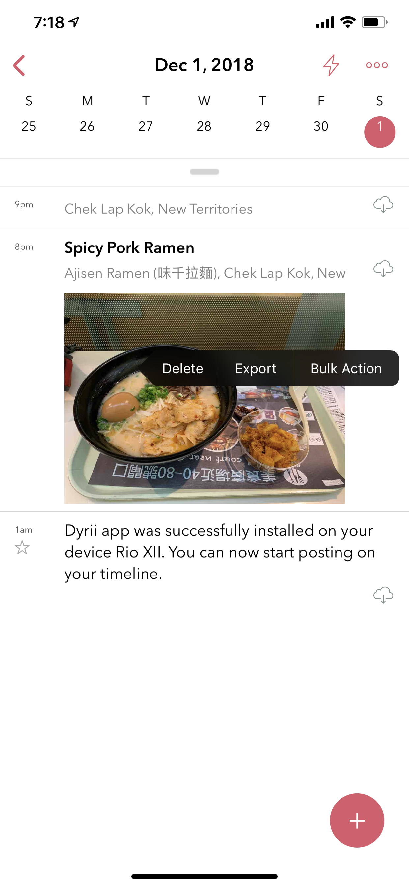
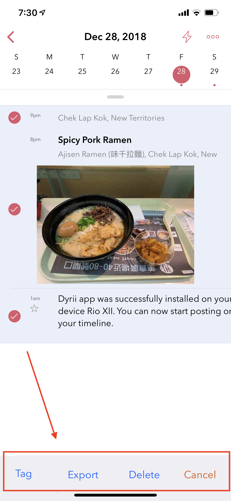
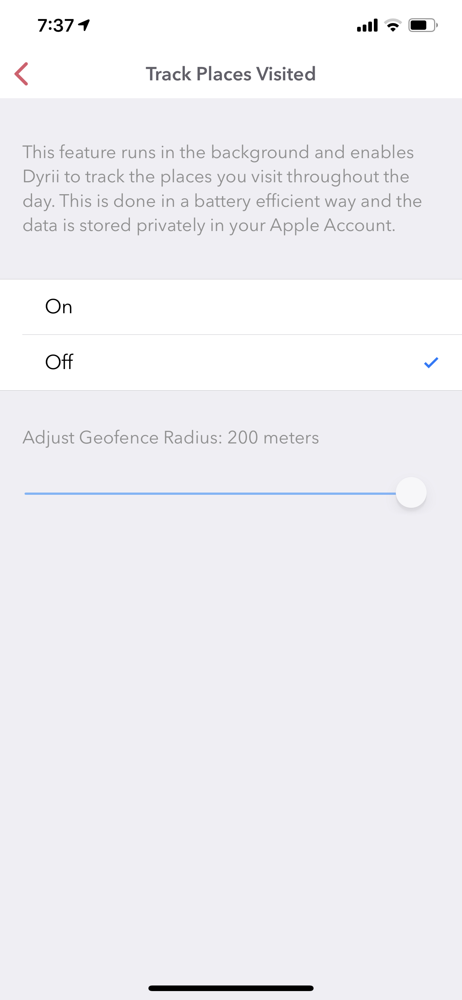
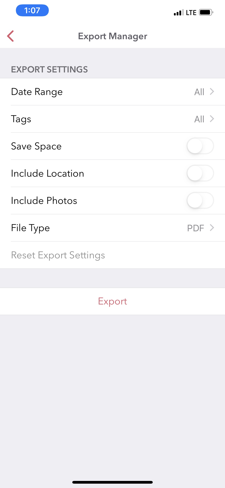

========
Tips & Tricks
========

.. index:: Keyword Shortcuts
Keyword Shortcuts
--------
Dyrii supports following URL Schemes for interfacing with externals apps.

Open Dyrii with New Post Window: dyrIi://pos Pin Location in Dyrii: dyrIi://pin

While, this functionality is limited right now, we plan to enhance this in a future release. If you have questions or feature request around this functionality, please leave comments.

.. index:: Search Tokens
Search Tokens
--------
Dyrii is equipped with a powerful search capability. The search function scans the local data available on the device as well as the data available on the cloud. The toggles for this local/cloud option resides under the search bar.

iOS: You can enter either plain text on the search box or special search keywords such as name of country, city, year, month, type, etc. to find the specific type of entry. These keywords should be prefixed by '@' symbol. For example @photo will find all photos from your journal, @2017 will find all posts from the year 2017, @january will find all posts from January.

Search Keyword Patterns
Here are some of the search keyword patterns:

.. code:: python
- @pin
- @image
- @photo
- @health
- @place
- @doodle
- @audio
- @video
- @January, @Jan, @Feb, etc.
- @[City Name]
- @[Country Code]
- @[State Code]
- @am
- @pm

Mac
On the mac, the search is located on the top of the sidebar. You can use all the above keyword patterns here as well.

.. index:: Bulk Edits
Bulk Editing
--------
Dyrii allows you to make following entry edit actions in bulk from the Timeline and Day view:

.. index:: Tags
Adding Tags
=========
Using this function, you will be able to tag multiple entries without having to do this one by one from the Entry detail screen.

.. index:: Delete
Deleting
=========
Using this function, you will be able to delete multiple entries without having to do this one by one. 

.. index:: Export
Export / Print
=========
Using this function, you will be able to select multiple entries and export them into a PDF or print them.

To access this bulk action, long tap on the entry cell and it will display a contextual menu with Bulk Action as shown in the below screenshot. Please note that this work from Timeline view, Day View, and any Perspective views.

.. index:: URL Schemes
App URL Schemes
--------
Dyrii supports following URL Schemes for interfacing with externals apps. 

Open Dyrii with New Post Window: dyrIi://pos
Pin Location in Dyrii: dyrIi://pin
 

While, this functionality is limited right now, we plan to enhance this in a future release. If you have questions or feature request around this functionality, please leave comments.

.. index:: Day Trails
Enabling Day Trails
--------

This feature tracks all the places you visit in a given day and draws it on a map view with pins indicating the places where you stopped over. This feature is turned off my default due to privacy reasons and need to be consciously turned on by the user from Settings > Personalization > Track Places Visited. This feature works by setting a geofence based on your current location and updating the geofence it when you move outside. Since the accuracy of the pins are based on the radius of the geofence, we have exposed the radius as an option that users can configure.

.. index:: Print
.. index:: PDF
.. index:: Export
Prints & PDFs
--------
A most common use case of exporting data from a journal is to print it or archive it as PDF. Dyrii supports exporting entries as PDFs. This can be done at entry level or view level (e.g exporting entries beloning to a given tag, year etc.). The PDF can be then printed using the default iOS print behavior. 

.. image:: _images/export_pdf_ios.jpeg
   :width: 300px
   :alt: iOS Timeline
   
In addition to the above, Dyrii contains a dedicated Export panel under Menu > Settings > Manage Data > Export, from where you can export and print with additional options.

.. index:: Import
.. index:: Apple Voice Memo
Importing from Voice Memo App
--------
Dyrii supports importing voice recordings from Apple's Voice Memo App on iOS. To import, select Share option from the Voice Memos app and select Dyrii from the export application list as indicated in the screenshots below.

.. image:: _images/import_voice_memo_ios_1.png
   :width: 300px
   :alt: iOS Timeline
   
.. image:: _images/import_voice_memo_ios_2.JPG
   :width: 300px
   :alt: iOS Timeline

.. index:: Apple Notes
Importing from Notes App
--------
Dyrii also supports importing Notes from Apple's Notes App on iOS. To import, select Share option from the Notes app and select Dyrii from the export application. Please note that since Dyrii doesn't support attachments other than images, videos, and audio files, such attachments if encountered will be skipped durning the import process.

.. index:: Dark Mode
.. index:: Smart Invert Mode
Smart Invert Mode
--------
While Dyrii doesn't have a dedicated dark mode, it does support Apple's Smart Invert Mode which provides a standarized dark interface across iOS. 
