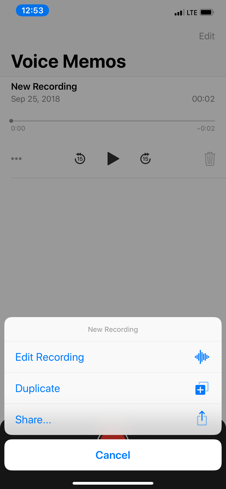

========
Tips & Tricks
========

Keywords Shortcuts
--------
Dyrii supports following URL Schemes for interfacing with externals apps.

Open Dyrii with New Post Window: dyrIi://pos Pin Location in Dyrii: dyrIi://pin

While, this functionality is limited right now, we plan to enhance this in a future release. If you have questions or feature request around this functionality, please leave comments.

Search Tokens
--------

Dyrii is equipped with a powerful search capability. The search function scans the local data available on the device as well as the data available on the cloud. The toggles for this local/cloud option resides under the search bar.

iOS

You can enter either plain text on the search box or special search keywords such as name of country, city, year, month, type, etc. to find the specific type of entry. These keywords should be prefixed by '@' symbol. For example @photo will find all photos from your journal, @2017 will find all posts from the year 2017, @january will find all posts from January.

Search Keyword Patterns
Here are some of the search keyword patterns:

.. code:: python
- @pin
- @image
- @photo
- @health
- @place
- @doodle
- @audio
- @video
- @January, @Jan, @Feb, etc.
- @[City Name]
- @[Country Code]
- @[State Code]
- @am
- @pm

Mac
On the mac, the search is located on the top of the sidebar. You can use all the above keyword patterns here as well.

Bulk Editing
--------
Dyrii is equipped with a powerful search capability. The search function scans the local data available on the device as well as the data available on the cloud. The toggles for this local/cloud option resides under the search bar.

Data Statistics
--------

Dyrii is equipped with a powerful search capability. The search function scans the local data available on the device as well as the data available on the cloud. The toggles for this local/cloud option resides under the search bar.

iOS

App URL Schemes
--------
Dyrii supports following URL Schemes for interfacing with externals apps. 

Open Dyrii with New Post Window: dyrIi://pos
Pin Location in Dyrii: dyrIi://pin
 

While, this functionality is limited right now, we plan to enhance this in a future release. If you have questions or feature request around this functionality, please leave comments.

Enabling Day Trails
--------

Dyrii is equipped with a powerful search capability. The search function scans the local data available on the device as well as the data available on the cloud. The toggles for this local/cloud option resides under the search bar.

iOS

Prints & PDFs
--------
A most common use case of exporting data from a journal is to print it or archive it as PDF. Dyrii supports exporting entries as PDFs. This can be done at entry level or view level (e.g exporting entries beloning to a given tag, year etc.).

.. image:: _images/export_pdf_ios.jpeg
   :width: 300px
   :alt: iOS Timeline

Importing from Voice Memo App
--------
Dyrii supports importing voice recordings from Apple's Voice Memo App on iOS. To import, select Share option from the Voice Memos app and select Dyrii from the export application list as indicated in the screenshots below.

   

Importing from Notes App
--------
Dyrii also supports importing Notes from Apple's Notes App on iOS. To import, select Share option from the Notes app and select Dyrii from the export application. Please note that since Dyrii doesn't support attachments other than images, videos, and audio files, such attachments if encountered will be skipped durning the import process.

Smart Invert Mode
--------
While Dyrii doesn't have a dedicated dark mode, it does support Apple's Smart Invert Mode which provides a standarized dark interface across iOS. 
