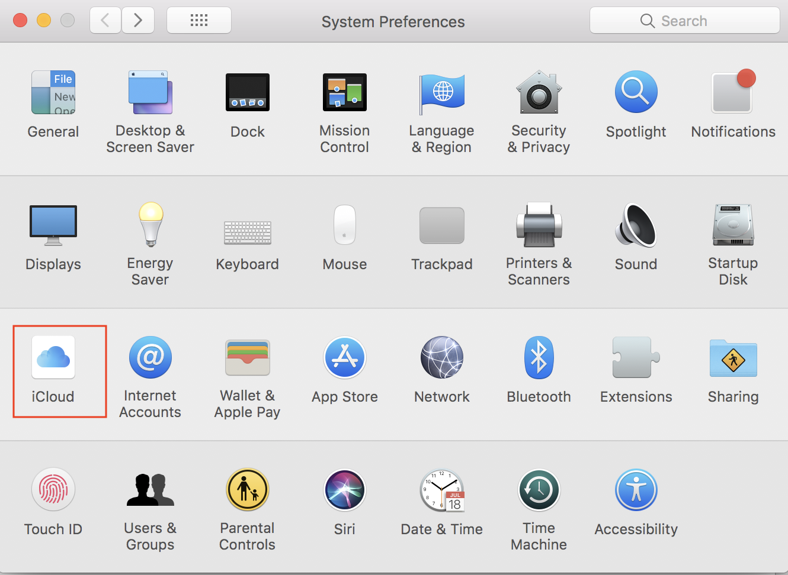
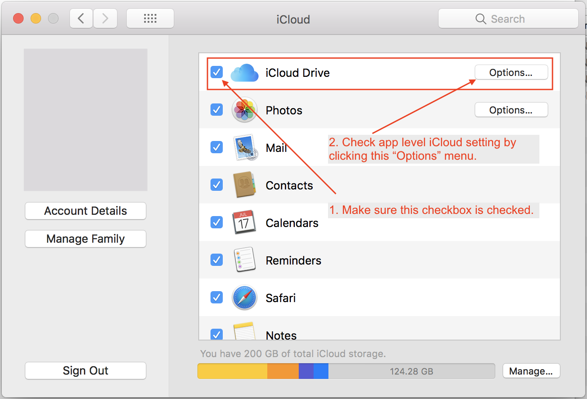
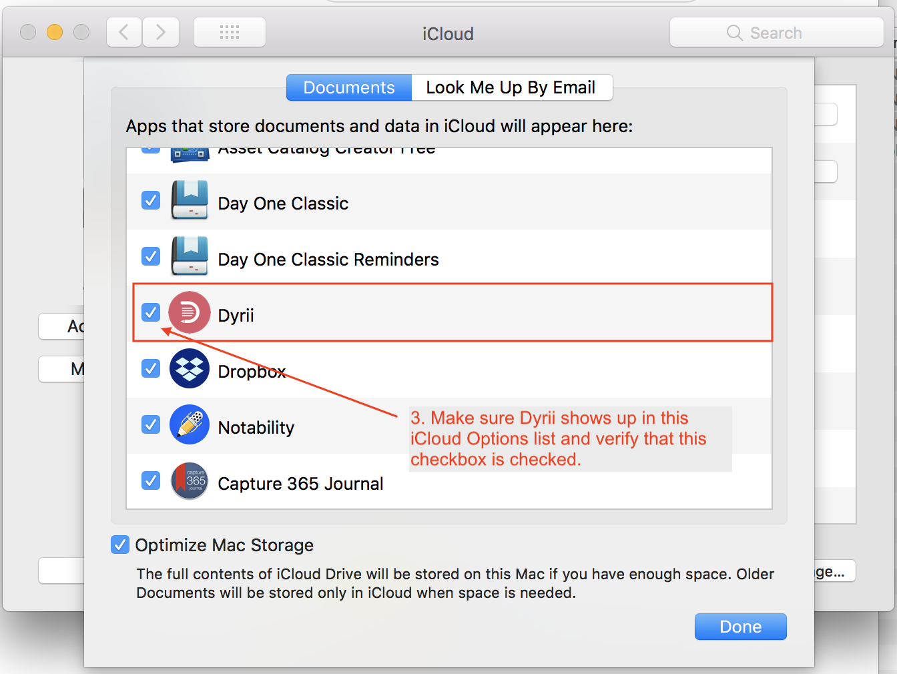

========
Troubleshooting & Support
========

Sync not working
--------

There are multiple reasons why sync may not be working. As as first step toward troubleshooting, we recommend that you go through our user guide article on Sync (see link below). 

Syncing

Next, make sure all your devices are connected to the same Apple ID under Account Settings and they are connected to the internet. Please note that we use Apple's iCloud (Cloudkit) platform for Sync and it requires all devices to be connected with the same Apple ID. 

If the above two steps fail to yield results, then check if iCloud is enabled on your Mac. This setting is located under macOS System Preference panel. See below few screenshots for reference. 

   This is the caption of the figure (a simple paragraph).
   

   This is the caption of the figure (a simple paragraph).

   This is the caption of the figure (a simple paragraph).

If the issue still persists, then please create a support ticket or contact us at support@dyrii.com.

What to do when App Crashes?
----------

Crashes occur due to various reasons. You can help us troubleshoot crashes by sending us the app log and crash files from the following location on your device.

1. Application Logs:

Open Finder and click on Menu/Go/Go To Folder and enter following folder path:

~/Library/Containers/com.ectree.Dyrii-Mac/Data/Library/DyriiDatabase/Logs/

Send us the .log files you see here.

For example: com.ectree.Dyrii-Mac 2017-07-17 19-10.log

2. Crash Logs:

Open Finder and click on Menu/Go/Go To Folder and enter following folder path:

~/Library/Logs/DiagnosticReports

Send us the .crash, .hang, .spin, or .diag files you see here with Dyrii_ prefix. Those are crashes corresponding to Dyrii app.

For example: Dyrii_2017-07-05-234426_spasskyPro9.crash

You can send this to bugs@dyrii.com.

Online Articles
----------

- Issue Tracker: github.com/$project/$project/issues
- Source Code: github.com/$project/$project

Contact us
----------
If you are having issues, please let us know. We have a mailing list located at: project@google-groups.com
